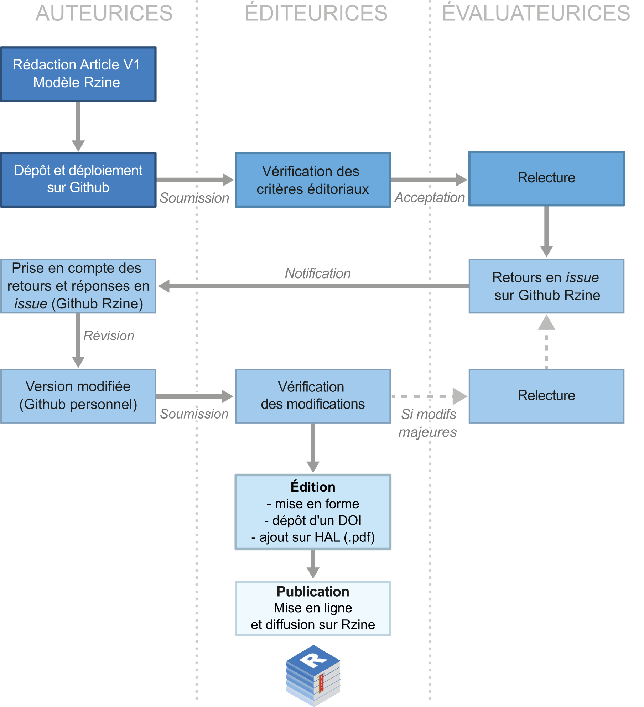
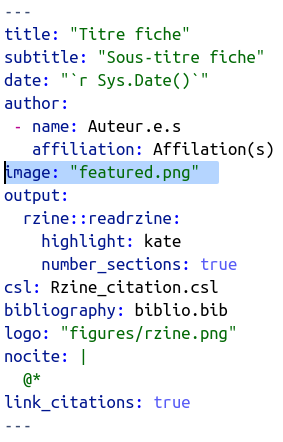
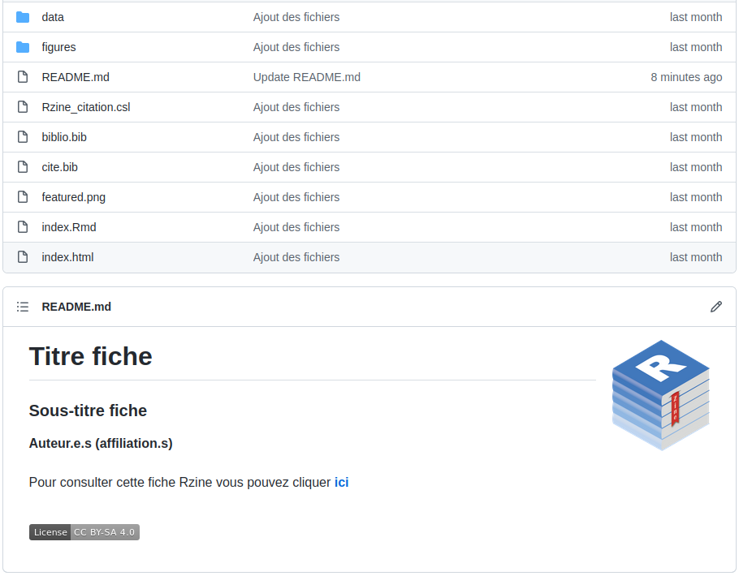

```{r setup, include=FALSE}

## Global options
knitr::opts_chunk$set(echo=TRUE,
        	            cache=FALSE,
                      prompt=FALSE,
                      comment=NA,
                      message=FALSE,
                      warning=FALSE,
                      class.source="bg-info",
                      class.output="bg-warning")


```


> Ce document vous accompagne dans la rédaction, la soumission et le processus de relecture d'une fiche Rzine

# Une fiche Rzine ?  

La "fiche" est l'un des formats de documentation de la collection Rzine. **Il s'agit d'un document didactique qui présente une méthodologie, un type d'analyse, une fonctionnalité, ou encore le traitement d'un certain type de données avec le logiciel R. Une fiche peut être principalement technique, méthodologique ou thématique, mais elle peut aussi couvrir ces trois aspects.Le premier objectif d'une fiche Rzine consiste à partager de manière pédagogique des méthodes reproductibles, applicables en SHS**

**La publication de fiche est ouverte à tou·te·s, quelque soit son statut et sa discipline. Une fiche peut être réalisée à plusieurs et présenter une dimension interdisciplinaire.** 

**Les auteur·e·s sont libres dans le choix de la problématique et dans la façon d'articuler le contenu. Cependant, il est indispensable que le contenu d'une fiche soit correctement contextualisé et qu'il soit intelligible par l'ensemble des disciplines de SHS. Il est également obligatoire de suivre les règles suivantes :**

- **Rédiger en français ou en anglais**
- **Utiliser le modèle de mise en page** `readrzine`
- **Introduire et contextualiser la fiche** 
- **Proposer du code entièrement reproductible**
- **Utiliser des données libres d'utilisation et mise à disposition**
- **Fournir certains fichiers et annexes associés** 


Vous pouvez consulter les premières fiches déjà produites pour vous faire une idée du résultat attendu :    

- [Analyse Territoriale Multiscalaire](https://rzine.fr/docs/20211101_ysebaert_grasland_MTA/index.html), *Ronan Ysebaert et Claude Grasland*.    
- [Analyse des corrélations avec easystats](https://rzine.fr/docs/20200526_glecampion_initiation_aux_correlations/index.html), *Grégoire Le Campion*.    
- [Exploration spatio-temporelle d’objets géographiques ponctuels](https://rzine.fr/docs/20200601_mletexier86_explo_spatiotemporel/index.html), *Marion Le Texier*.    
- [Réaliser une carte de discontinuités en 2,5D](https://neocarto.github.io/ironcurtain/), *Nicolas Lambert*.


**Rzine souhaite promouvoir l'usage de logiciels contribuant à une science plus ouverte et reproductible, et participer à une montée en compétence des disciplines de SHS dans ce domaine.** C'est pour cela que **l'ensemble du processus d'évaluation se déroule sur** [**GitHub**](https://github.com/), service web d'hébergement et de gestion de développement de logiciels qui repose sur le logiciel de gestion de versions [Git](https://git-scm.com/). 


<div class="alert alert-success" role="alert">
<b>Cela ne doit en aucun cas effrayer les auteur·e·s qui n'ont jamais utilisé ce genre de logiciel. De la documentation et une assistance sont fournies par le comité éditorial Rzine... Profitez-en pour vous former à cet outil qui change la vie !</b></div>


## Critères d'acceptation

Afin d'assurer la cohérence de la collection et une certaine qualité du contenu des fiches Rzine, plusieurs critères d'acceptation ont été établis. Certains de ces critères sont soumis à un ou plusieurs évaluateur·rice·s, d'autres peuvent faire l'objet d'un refus immédiat de la part des éditeur·rice·s du [comité de lecture](https://rzine.fr/collection/#people).  

**Les éditeur·rice·s et les évaluateur·rice·s veilleront à ce que la démonstration soit contextualisée (champ disciplinaire d'application, enjeux en terme de reproductibilité...) et rigoureuse. Le code présenté se doit d'être lisible, commenté et reproductible. Les packages mobilisés doivent être brièvement décrits et leur utilisation justifiée. Enfin, les données utilisées dans le cadre de la démonstration doivent obligatoirement être sourcées, libres de droit et mises à disposition.**


|  Critères d'évaluations d'une fiche                                |  Editeur·rice·s | Evaluateur·rice·s |
|--------------------------------------------------------------------|:-------------:|:-------------:|
| Respect des consignes éditoriales ([partie 4](#la-rédaction-dune-fiche))    |       X       |               |
| Acceptation des futures conditions d'utilisation [**CC BY-SA 4.0**](https://creativecommons.org/licenses/by-sa/4.0/deed.fr)  |      X        |               |
| Pas de fiche Rzine similaire déjà produite*                        |       X       |               |
| N'a pas fait l'objet d'une publication par ailleurs                |       X       |               |
| Pas de renvoi publicitaire explicite                               |       X       |       X       |
| Respect du Règlement Général sur la Protection des Données         |       X       |       X       |
| Intérêt pour la communauté des utilisateurs de R en SHS            |       X       |       X       |
| Données utilisées libres, sourcées et mises à disposition  ([partie 4.?](#la-rédaction-dune-fiche))        |       X       |       X       |
| Rédaction dans un français ou un anglais correct                   |               |       X       |
| Concerne des méthodes applicables aux SHS                          |               |       X       |
| Contextualisation de l'analyse ou méthode présentée          |               |       X       |
| Présentation des prérequis techniques et méthodologiques           |               |       X       |
| Clarté et rigueur de la ressource et de la démonstration           |               |       X       |
| Clarté (indentation, commentaire...) et reproductibilité du code présenté  |       X        |       X       |
| Justification (et stabilité) des packages utilisés                 |       X      |       X       |

*Le cas échéant, le comité de lecture se réserve la possibilité de mettre en relation différents contributeur.rice.s pour leur proposer la rédaction collaborative d'une fiche. 


## Format et template

**Une fiche Rzine est document computationnel**, alternant du texte et du code. **Il s'agit d'un fichier HTML produit en R Markdown. Il se construit avec R et repose sur les packages** [**rmarkdown**](https://rmarkdown.rstudio.com/) **et** [**knitr**](https://yihui.org/knitr/). 

**Un modèle de mise en page est mis à disposition par le biais du package** [`rzine`](https://gitlab.huma-num.fr/rzine/package). Son installation ainsi que la création d'une fiche Rzine vierge sont expliqués dans la [partie 2](#le-package-rzine).

## Soumission et évaluation

**L'ensemble du processus de soumission et d'évaluation d'une fiche se déroule sur** [**GitHub**](https://github.com/). **Cela facilite la gestion de version et permet l'archivage et la transparence de l'évaluation d'une fiche.**

Pour être soumise à évaluation, une fiche doit être déposée et déployée sur GitHub ([cf. partie 5](#la-soumission-dune-fiche)). 

Dans le cas où l'ensemble des critères d'acceptations sont respectés, le comité de lecture propose un ou deux évaluateur·rice·s à l'auteur·e. Une fois le processus d'évaluation enclenché, les évaluateur·rice·s et éditeur·rice·s font directement leurs retours(publics) sur sur GitHub ([cf. partie 6](#le-processus-de-relecture)).

 
```{r, echo=FALSE, out.width="95%",  fig.align = 'center'}

```


## publication et licence

Une fois le processus d'évaluation terminée, **des éditeur·rice·s, membres du comité de lecture, s'occupent alors de la mise en page final de la fiche, du dépôt d'un DOI, du référencement du document sur HAL et de sa mise en ligne sur le site** [**rzine.fr**](https://rzine.fr/publication_rzine/).

Le projet Rzine souhaite promouvoir les pratiques contribuant à une science plus ouverte et reproductible. C'est **pour cette raison que l'ensemble des publications de la collection Rzine (et leurs codes sources) sont automatiquement mis à disposition de tou·te·s et libres de droit.

<div class="alert alert-danger" role="alert">
<b>Etre auteur.e d'une fiche Rzine, c'est donc accepter à ce que votre document soit mise à disposition sous les conditions d'utilisation de la [<b>licence Creative Commons BY-SA 4.0</b>](https://creativecommons.org/licenses/by-sa/4.0/deed.fr).</b></div>


Vous autorisez ainsi quiconque à :

- **Partager** — *copier, distribuer et communiquer la fiche par tous moyens et sous tous formats*
- **Adapter** — *remixer, transformer et créer à partir du matériel pour toute utilisation, y compris commerciale*. 

Selon les conditions suivantes :

- **Attribution** — *L'Œuvre doit être crédité, un lien vers la licence doit être indiqué, tout comme les modifications effectuées à l'Oeuvre original. Ces informations doivent être indiquées par tous les moyens raisonnables, sans toutefois suggérer que l'Offrant (vous!) soutient la façon dont son Oeuvre a été utilisée.* 
- **Partage dans les Mêmes Conditions** — *Dans le cas où quelqu'un effectue un remix, transforme, ou crée à partir du matériel composant l'Oeuvre originale, il doit diffuser l'Oeuvre modifiée dans les même conditions, c'est à dire avec la même licence avec laquelle l'Oeuvre originale a été diffusée.* 

**Afin d’éviter tout malentendu avec les auteur·e·s, la signature d’un accord de principe sera demandé**.


# Le package `rzine`

**Le package** [`Rzine`](https://gitlab.huma-num.fr/rzine/package) **met à disposition le modèle de mise en page des fiches Rzine**, ainsi que l'ensemble des fichiers associés à fournir.

## Installation du package

Le package est mis à disposition sur un [depôt de l'organisation Rzine](https://gitlab.huma-num.fr/rzine/package) sur le GitLab Humanum.   
**Pour l'installer et le charger, exécutez les lignes suivantes :**

```r
# install.packages(remotes)
remotes::install_gitlab("rzine/package", host = "https://gitlab.huma-num.fr/", force = TRUE)
library(rzine)
```

## Utiliser le template `readrzine`

**Avant de générer une fiche Rzine vierge, il est important de spécifier un répertoire de travail.**

### Un répertoire de travail

Pour cela, deux solutions s'offrent à vous :

#### Solution standart

Créez un répertoire sur votre ordinateur, et spécifiez-le comme répertoire de travail avec la ligne de commande suivante :

```r
setwd("/home/jeanne/Documents/Fiche_rzine")
```

#### Solution Rstudio (recommandée)

Créez un projet Rstudio. Pour cela, cliquez sur *File/New Project*, puis sélectionnez *New Directory* :

```{r, echo=FALSE, fig.align='center', out.width = "55%"}
knitr::include_graphics("figures/create_project.png")
```

<div class="alert alert-success" role="alert">
<b>La création du projet Rstudio engendre la création d'un répertoire du nom du projet et le paramétrage automatique de ce dossier comme répertoire de travail.</b></div>

### Générer une fiche vierge

**Vous pouvez ensuite générer une fiche `readrzine` vierge en ligne de commande. Pour cela, copiez-collez les lignes de code suivantes sans les modifier, puis exécutez :**

```r
rmarkdown::draft(file = "index.Rmd", 
                 template = "readrzine", 
                 package = "rzine", 
                 create_dir = FALSE, 
                 edit = FALSE)
```


**Cela génère un ensemble de fichiers à la racine de votre répertoire de travail.** Certains fichiers sont à modifier (ou à remplir pour les sous-répertoires) en fonction du contenu de votre fiche : 


```{r, echo=FALSE, fig.align='center', out.width = "90%"}

```


## Générer la fiche en HTML

Le fichier central, le plus important est index.Rmd (ne modifiez pas son nom), il s'agit d'un fichier R markdown, fichier source de votre fiche à partir duquel sera généré le document HTML.

Pour cela, il suffi de kniter ce fichier. Le fait de kniter (*tricoter*) un document R Markdown revient à le convertir dans un premier temps en format markdown puis (dans ce cas) en format HTML via [**Pandoc**](https://pandoc.org/installing.html) (logiciel libre de conversion de documents). Sur certains systèmes d'exploitation (comme Windows), **il peut-être nécessaire d'installer** [**Pandoc**](https://pandoc.org/installing.html) précédemment.

Vous pouvez **générer (kniter) le R Markdown `readrzine` en format HMTL** en ligne de commande ou depuis l'interface Rstudio.

### En ligne de commande

Copiez-collez ces lignes de commande (chemin à personnaliser) pour générer le fichier HTML :

```r
rmarkdown::render(".../Ma_fiche_Rzine/Ma_fiche_Rzine.Rmd", envir = new.env())
```
### Avec Rstudio

Ou cliquez sur `knit` depuis l'interface Rstudio :

```{r, echo=FALSE, fig.align='center', out.width = "60%"}
knitr::include_graphics("figures/knit.png")
```

Vous pouvez également utiliser le raccourci clavier `CTRL+SHIFT+K`

*Kniter* votre R Markdown aura pour conséquence la création d'un fichier du même nom mais en sortie html. Il s'agit de votre  Markdown mise en page avec le modèle de mise en page `readrzine` :


```{r, echo=FALSE, fig.align='center', out.width = "100%"}
knitr::include_graphics("figures/template.png")
```

**Ce fichier HTML (index.html) est automatiquement enregistré à la racine du répertoire source**. 


# Anatomie d'un R Markdown

Le template `readrzine` fonctionne comme n'importe quel R Markdown. Cependant certaines métadonnées et certains contenus sont à renseigner obligatoirement et une certaine mise en page est à respecter.

## L'en-tête

L’en-tête d’un document R Markdown (parfois appelé YAML header) est délimité par deux lignes de pointillés et contient les métadonnées et les éléments de style du document.

**Commencez par personnaliser l'en-tête du template `readrzine` vierge** en modifiant le **titre**, le **sous-titre**, le.s nom.s de ou des **auteur.es** et les **affiliations**, exemple : 

```{r, echo=FALSE, fig.align='center', out.width = "75%"}

```

## Le corps du document 

**Le corps d’un document R Markdown comprend deux types de blocs**, que l’on peut alterner librement :

- **Des blocs de texte brut** mis en forme selon la **syntaxe markdown**   
- **Des blocs de code R** (appelés ***chunks**) encadrés par les balises ` :    
    - Ces *chunks* peuvent être nommés (recommandé) 
    - De nombreuses options sur le comportement du *chunk* peuvent être spécifiées.

### Les blocs de texte

Le corps du document est constitué de texte en syntaxe Markdown. **Le markdown est un langage de balisage léger** et très facile à maîtriser, **qui permet de définir des niveaux de titres ou de mettre en forme le texte**. 

Par exemple, **le texte suivant :**

```
Ceci est du texte en *italique*, **gras** ou en ***Gras italique***.

Pour définir des listes à puces, utilisez les **tirets** :

- premier élément
- deuxième élément

Vous pouvez également ajouter des [liens cliquables](https://rzine.fr/) 

```

**Se formalisera comme cela dans le fichier HTML produit à partir du R Markdown :**

Ceci est du texte en *italique*, **gras** ou en ***Gras italique***.

Pour définir des listes à puces, utilisez les **tirets** :

- premier élément
- deuxième élément

Ou encore ajouter des [liens cliquables](https://rzine.fr/).  

Il est possible d'écrire des formules mathématiques en langage $\TeX$. Pour cela, il suffit de délimiter le contenu $\LaTeX$ par **un ou deux** symboles **$**, ex :  

```
$$ y = \sqrt{\frac{1}{x + \beta}} $$ 
```
En mode ***Inline*** (**1 $**) , les formules sont incluses à l'intérieur du paragraphe courant, ex : $\sum_{i=1}^n X_i$    
En mode ***Displayed*** (**2 $**), elles apparaissent centrées et mises en exergue, ex : $$ y = \sqrt{\frac{1}{x + \beta}} $$   


Sur le Web, **vous trouverez beaucoup de documentation sur le langage de balisage markdown**. **Quelques références sont listées dans la** [**partie 3.4**](#quelques-références)

### Les chunks

En plus du texte libre en syntaxe markdown, un document R Markdown peut contenir, comme son nom l’indique, du code R. Celui-ci est inclus dans des ***chunks*** délimités par la syntaxe suivante :

```{r, echo=FALSE}
rmd = "figures/chunck1.Rmd"
cat(readLines(rmd), sep = "\n")
```

Pour insérer un nouveau chunk, utilisez le menu ***Insert*** de RStudio. Vous pouvez également utiliser le raccourci clavier `Ctrl+Alt+i` :

```{r, echo=FALSE, fig.align='center', out.width = "15%"}
knitr::include_graphics("figures/insert.png")
```

Vous pouvez donner un nom unique à chaque *chunk*, de la manière suivante :

```{r, echo=FALSE}
rmd = "figures/chunck2.Rmd"
cat(readLines(rmd), sep = "\n")
```

Il n'est pas obligatoire de nommer un *chunk*, mais cela peut être utile pour localiser une erreur lors de la compilation. 

Un certain nombre d'options peuvent également être ajoutées sous la forme `option = valeur`. Exemple : 

```{r, echo=FALSE}
rmd = "figures/chunck3.Rmd"
cat(readLines(rmd), sep = "\n")
```

L'option `echo` permet d'indiquer si l'on souhaite afficher le code dans le document. L'option `warning` permet de choisir d'afficher ou non les warnings générés par le bloc de code dans le document. Voici **la liste des principales options disponibles** :

Option   |    Valeurs    |  Description
---------|---------------|-------------------------------------------
echo     | TRUE/FALSE    | Afficher ou non le code R dans le document
eval     | TRUE/FALSE    | Exécuter ou non le code R à la compilation
include  | TRUE/FALSE    | Inclure ou non le code R et ses résultats dans le document
warning  | TRUE/FALSE    | Afficher ou non les avertissements générés par le bloc
message  | TRUE/FALSE    | Afficher ou non les messages générés par le bloc

**L'ensemble des options disponibles sont décrites dans le** [**guide de référence R Markdown**](https://www.rstudio.com/wp-content/uploads/2015/03/rmarkdown-reference.pdf). Ces options sont également décrites dans plusieurs références listées dans la [**partie 3.4**](#quelques-références).


## Kniter un R Markdown


## Quelques références

**Pour en savoir plus et se former au Rmarkdown et à la syntaxe markdown :**

- [Cookbook R Markdown](https://bookdown.org/yihui/rmarkdown-cookbook/), de Y. Xie, C. Dervieux & E. Riederer
- [R Markdown Definitive Guide](https://bookdown.org/yihui/rmarkdown/), de Y. Xie, J. J. Allaire & G. Grolemund
- [R Markdown for Scientists](https://rmd4sci.njtierney.com/), de Nicholas Tierney
- [Introduction à R et au tidyverse](https://juba.github.io/tidyverse/13-rmarkdown.html), de Julien Barnier 
- [Travail collaboratif avec R](https://linogaliana.gitlab.io/collaboratif/rmd.html), de Lino Galiana
- [Pimp my RMD: a few tips for R Markdown](https://holtzy.github.io/Pimp-my-rmd/), de Yan Holtz
- [R for Data Science](), de H. Wickham & G. Groelemund
- [Guide de la syntaxe R Markdown](https://rmarkdown.rstudio.com/authoring_basics.html), de Rstudio
- [guide de référence R Markdown](https://www.rstudio.com/wp-content/uploads/2015/03/rmarkdown-reference.pdf), de Rstudio 
- [R Markdown Cheatsheet](https://www.rstudio.com/wp-content/uploads/2015/02/rmarkdown-cheatsheet.pdf), de Rstudio
- [Writing Reproducible Research Papers with R Markdown](https://resulumit.com/teaching/rmd_workshop.html#1), de Resul Umit


 
 
# La rédaction d'une fiche

Les auteur.e.s sont libres dans le choix de la problématique et dans la façon d’articuler le contenu de leur fiche Rzine, mais **afin d'assurer une certaine cohérence éditoriale et une qualité du contenu de la collection, les auteur.e.s sont soumis à quelques obligations dans l'organisation du contenu**.

## Introduction & contextualisation

**Une fiche doit obligatoirement contenir une introduction, qui explicite l'objectif, le contenu et les données utilisés**. Si nécessaire, il est également demandé au auteure.s de **contextualiser le contenu, autant sur le plan thématique que technique**. N'hésitez-pas à ajouter des références dans la bibliographie.

**Une fiche Rzine doit s'adresser à l'ensemble des disciplines de SHS et des sciences territoriales. Considérez que vos lecteur.rice.s ne seront pas forcément des spécialistes de la thématique ou méthode présentée !**


## Données utilisées

L'intégralité des données utilisées pour une fiche doivent :   

- **Être présentées et décrites** dans la fiche.   
- **Être libre d'utilisation** et de diffusion.   
- **Être mises à disposition** des lecteur.rice.s, **même si ces données sont déjà en libre accès**.    
- **Être associées à des métadonnées** qui permettent de retracer et comprendre ces données.    
- **Respecter le Règlement Général sur la Protection des Données**.   

**Toutes les données chargées et utilisées dans une fiche devront être stockées dans le répertoire :** 


```{r, echo=FALSE, fig.align='center', out.width = "15%"}
knitr::include_graphics("figures/folder_data.png")
```

**Chaque fichier de données ajouté doit être associé à un fichier de métadonnées !**


## Illustrations
### Illustration de couverture

**Le template** `readrzine` **permet l'affichage d'une illustration en couverture** :

```{r, echo=FALSE, fig.align='center', out.width = "100%"}
knitr::include_graphics("figures/template.png")
```


**Cela n'est pas obligatoire**. Si vous ne souhaitez pas d'image de couverture, supprimez tout simplement la métadonnée concernée dans l'en-tête du R Markdown :

```{r, echo=FALSE, fig.align='center', out.width = "30%"}

```

Sinon, **pour modifier l'illustration par défaut**, il suffit de **remplacer l'image nommée featured.png à la racine du répertoire par celle de votre choix** (le nom doit être identique !) :


```{r, echo=FALSE, fig.align='center', out.width = "25%"}

```

Pour un rendu correct, **le format attendu de cette image de couverture est de type 'bandeau'** (ex : **750 x 300**). N'hésitez pas à contacter le comité éditorial si vous ne maîtrisez pas cet aspect : [**contact@rzine.fr**](mailto:contact@rzine.fr).


### Illustration dans le corps du texte

Les illustrations affichées dans le corps d'une fiche doivent être **stockées dans le répertoire "figures"**. 

Il est recommandé de les insérer dans votre markdown en **utilisant un** ***chunk*** **de code R, et non la syntaxe markdown ou des balises HTML !**

Par exemple, ce chunk...

```{r, echo=FALSE}
rmd = "figures/chunck6.Rmd"
cat(readLines(rmd), sep = "\n")
```

... Permet d'afficher l'image "folder_figures.png" centrée et représentant 15% de la largeur du document. Ex :

```{r, echo=FALSE, fig.align='center',  out.width = "15%"}


```

**Plusieurs options sont disponibles** pour paramétrer l'image affichée. Vous pouvez les consulter dans le [guide de référence R Markdown](https://www.rstudio.com/wp-content/uploads/2015/03/rmarkdown-reference.pdf) de Rstudio.


## Bibliographie

Bien qu'il ne s'agisse pas d'une obligation, le template `readrzine` intègre automatiquement cette section. **Si vous ne souhaitez pas afficher de bibliographie dans votre fiche, vous pouvez supprimer les lignes suivantes de votre R Markdown :**

```
# Bibliographie {-}

<div id="refs"></div>
```

**Si cette section vous intéresse, ne modifiez pas ces lignes**. Il vous suffira de **modifier/compléter les différentes références bibliographiques que vous souhaitez utiliser dans le fichier "biblio.bib"** (format BibTeX), situé à la racine du répertoire :

```{r, echo=FALSE, fig.align='center', out.width = "25%"}

```

Le template par défaut du fichier biblio.bib :

```
@Manual{R-base,
  title = {R: A Language and Environment for Statistical Computing},
  author = {{R Core Team}},
  organization = {R Foundation for Statistical Computing},
  address = {Vienna, Austria},
  year = {2020},
  url = {https://www.R-project.org/},
}

@Manual{R-knitr,
  title = {knitr: A General-Purpose Package for Dynamic Report Generation in R},
  author = {Yihui Xie},
  year = {2020},
  note = {R package version 1.28},
  url = {https://CRAN.R-project.org/package=knitr},
}

@Manual{R-rmdformats,
  title = {rmdformats: HTML Output Formats and Templates for 'rmarkdown' Documents},
  author = {Julien Barnier},
  year = {2021},
  note = {R package version 1.0.2},
  url = {https://github.com/juba/rmdformats},
}
```

**Pour citer une références dans le corps du texte, utilisez la syntaxe suivante :**     `[@Citation Key]`.      
Par exemple `[@R-base]` affichera [@R-base] dans le corps du document. 

**Toutes les références bibliographiques présentes dans le fichier biblio.bib seront automatiquement ajoutées dans la section "[Bibliographie](#bibliographie-1)".**


## Informations session

**Cette section obligatoire est directement intégrée au template** : 

```{r, echo=FALSE}
rmd = "figures/chunck4.Rmd"
cat(readLines(rmd), sep = "\n")
```

**Ne modifiez et ne déplacez pas cette section**. Il s'agit de la première partie obligatoire des annexes.

Ce bout de code affiche des informations sur la session qui a permis de générer cette fiche (système d'exploitation, version de R et des packages utilisés). Voir l'[exemple](#info-session) pour ce document.

## Citation

**Cette section obligatoire est directement intégrée au template :**

```{r, echo=FALSE}
rmd = "figures/chunck5.Rmd"
cat(readLines(rmd), sep = "\n")
```

Ces deux chunks permettent l'affichage de la référence bibliographique de votre fiche dans le corps du document ([Voir l'exemple pour ce document](#citation-1)), ainsi que le stockage de cette référence en format BibTex, enregistrée dans le fichier *cite.bib* à la racine du répertoire.

**Ne mofifiez pas cette section**. **Elle sera complétée avant publication par l'équipe éditoriale.**


## Glossaire

**Cette section n'est pas obligatoire**, cependant vos lecteur.rices ne seront pas forcément issus de votre discipline ou ne maîtriseront peut-être pas la thématique et/ou méthode présentée. Pour que l'ensemble de la démonstration soit compréhensible par un public large, **vous pouvez utiliser la section "glossaire" pour définir certains termes utilisés dans la fiche**.

Pour cela, il suffit d'**utiliser la syntaxe markdown suivante** dans le corps du texte :

```
Blabla bla bla bla bla mot à définir^[__Mot à définir__: Définition du terme... ect]
```


Au knit du document en format HTML, **un numéro est associé et affiché après le "mot à définir". Et ce mot et sa définition seront ajoutés dans la section glossaire**.

Exemple : **Mot à définir**^[__Mot à définir__: Définition du terme à définir... ect.]

**Un lien interactif est alors automatiquement crée entre le "mot" dans le corps du texte et sa définition dans la section "Glossaire"**.


Si vous ne souhaitez pas utilisez de "[Glossaire](#endnotes)", vous pouvez supprimer ces lignes du template `readrzine` :

```
## Glossaire {- #endnotes}

```{js, echo=FALSE}

$(document).ready(function() {
  $('.footnotes ol').appendTo('#endnotes');
  $('.footnotes').remove();
});

```
```

# La soumission d'une fiche

**Une fois que la rédaction de votre fiche est terminée**, c'est à dire que :

1) **Le fichier index.Rmd est rédigé.**   
2) **Le fichier index.Rmd a été compilé en format HTML** ([knit](#kniter-un-r-markdown)).   
3) **L'ensemble des fichiers annexes ([biblio.bib](#bibliographie) et [featured.png](#illustration-de-couverture)) ont été complétés ou remplacés**.    
4) **Les répertoires "[figures](#illustration-dans-le-corps-du-texte)" et "[data](#données-utilisées)" ont été remplis** par les fichiers attendus

**Vous pouvez soumettre votre fiche au comité éditorial Rzine !**

Une fois votre fiche rédigée, vous devriez être en possession d'un répertoire contenant les fichiers et sous-répertoires suivants. Comme indiqué dans la [documentation](https://rzine.gitpages.huma-num.fr/Help_Rzine_Layout/), **les fichiers** *biblio.bib* **et** *featured.png* **ne sont pas obligatoires** :

```{r, echo=FALSE, fig.align='center', out.width = "25%"}

```

<div class="alert alert-danger" role="alert">
**Il est impératif que les fichiers** "***.Rmd***" et "***.html***" **soient nommés** "***index.Rmd***" et  "***index.html***" **pour la suite du processus.**</div>

**Vous êtes alors en mesure de soumettre votre travail au comité de lecture Rzine**. Pour cela, vous devez :   

1) **Déposer votre travail sur un dépôt Git** ([logiciel de gestion de versions décentralisé](https://fr.wikipedia.org/wiki/Git)).     
2) **Déployer la fiche en format HTML depuis le dépôt Git** pour la rendre consultable en ligne.    
3) **Contacter le comité de lecture** en lui fournissant l'adresse du dépôt.    

**Ne soyez pas inquiet si vous n'avez aucune connaissance de Git, ce document détaille clairement toutes les étapes à réaliser. Profitez-en pour vous former à cet outil puissant qui change la vie !**

## Premiers pas sur Github

**Le logiciel de gestion de versions décentralisé à utiliser pour la soumission est** le plus connu et le plus utilisé dans le monde : [**GitHub**](https://github.com/). La première chose à faire est donc de vous créer un compte.


### Création de compte

**Connectez-vous à la** [**page de création de compte GitHub**](https://github.com/signup?ref_cta=Sign+up&ref_loc=header+logged+out&ref_page=%2F&source=header-home). 

```{r, echo=FALSE, fig.align='center', out.width = "60%"}
knitr::include_graphics("figures/email_github.png")
```

**Saisissez le courriel que vous souhaitez utiliser, un mot de passe, un nom d'utilisateur et répondez aux questions de sécurité pour créer votre compte.** Un code de sécurité vous sera envoyé au courriel renseigné afin de valider la création du compte...

### Création d'un dépôt

Vous avez désormais un compte GitHub :

```{r, echo=FALSE, fig.align='center', out.width = "100%"}
knitr::include_graphics("figures/welcome_github.png")
```

**Cliquez sur** "***Start a project***" ou "***Create repository***" **pour créer un dépôt qui hébergera votre fiche**.


Vous pouvez également créer un nouveau dépôt en cliquant sur "***+***" puis "***New repository***" en haut à droite de la fenêtre :

```{r, echo=FALSE, fig.align='center', out.width = "40%"}
knitr::include_graphics("figures/new_repo.png")
```

Un fois sur la page de création d'un nouveau dépôt, **saisissez un nom de dépôt** (sans espaces ni caractères spéciaux) et éventuellement une description. **Initialisez ce dépôt comme** ***Public*** et **demandez l'ajout automatique d'un fichier** ***README.md*** :

```{r, echo=FALSE, fig.align='center', out.width = "70%"}
knitr::include_graphics("figures/create_repo.png")
```

Puis cliquez sur "***Create repository***". **Votre dépôt**, uniquement rempli d'un fichier README.md, **a été créé :**

```{r, echo=FALSE, fig.align='center', out.width = "100%"}
knitr::include_graphics("figures/new_repo_2.png")
```

## Remplissage du dépôt

**Vous pouvez désormais y ajouter le répertoire contenant tous les fichiers (et sous-répertoires) de votre Fiche**. 

**Il existe plusieurs méthodes pour téléverser des fichiers sur GitHub (en ligne de commande ou en clic-bouton). Nous présentons ici la méthode clic-bouton depuis l’interface de GitHub**.

Pour cela, cliquez sur "***Add file***", puis sur "***Upload files***" :.

```{r, echo=FALSE, fig.align='center', out.width = "45%"}
knitr::include_graphics("figures/upload_file.png")
```

**Faîtes glisser l'ensemble des fichiers et sous-répertoires de votre fiche dans le dépôt** :

```{r, echo=FALSE, fig.align='center', out.width = "100%"}

```

**Ajoutez un commentaire et cliquez sur** "***Commit changes***" :

```{r, echo=FALSE, fig.align='center', out.width = "100%"}
knitr::include_graphics("figures/commit_changes.png")
```

**Vous venez de réaliser votre premier** "***commit***" (enregistrement des changements). **L'ensemble des fichiers sont désormais stockés sur le dépôt :** 

```{r, echo=FALSE, fig.align='center', out.width = "100%"}

```

Ce dépôt étant paramétré comme *Public*, **tout le monde peut désormais consulter et récupérer ces fichiers**.

## Déploiement de la fiche

Les fichiers sont consultables à l'état brut, mais **une manipulation supplémentaire va permettre de mettre en ligne votre fiche (format HTML)**. **Votre fiche mise en page sera ainsi consultable par tout le monde sur le web**, sans avoir à gérer un serveur ou un site web. C'est trais utile, et très facile à faire !

### GitHub Page

**Cliquez sur** "***Settings > Pages > Source (none)***" et sélectionnez la branche "***main***" :

```{r, echo=FALSE, fig.align='center', out.width = "100%"}
knitr::include_graphics("figures/deploy.png")
```

<div class="alert alert-danger" role="alert">
**Pour que cela fonctionne, le fichier html à déployer (et le rmd pour plus de cohérence) doivent impérativement avoir été renommés** "***index***".</div>

**Ne modifiez pas le répertoire ciblé par défaut** **(**"***root***"**)** qui indique la racine du dépôt. **Cliquez sur** "***save***" **:**

```{r, echo=FALSE, fig.align='center', out.width = "80%"}
knitr::include_graphics("figures/GitHub_Pages.png")
```


**Félicitations ! Votre fiche est désormais consultable en ligne depuis votre compte GitHub !**   

**La page html est alors distribuée à l'adresse suivante : https://**`username`**.gitub.io/**`repository_name`**/**.   
**Vous pouvez retrouver l'URL d'accès dans le menu** "***Settings > Pages***" **:**

```{r, echo=FALSE, fig.align='center', out.width = "90%"}
knitr::include_graphics("figures/deploy_url.png")
```
  
**Cliquez sur le lien affiché pour consulter la fiche mise en ligne :**

```{r, echo=FALSE, fig.align='center', out.width = "100%"}
knitr::include_graphics("figures/online.png")
```

### README.md

**Le fichier markdown** "***README***" est utilisé **pour présenter les informations importantes à propos du dépôt**. **Son contenu est automatiquement affiché** (et mise en forme grâce à la syntaxe markdown) **en dessous des fichiers listés du dépôt**.

**Vous pouvez éditer et modifier facilement ce fichier depuis l'interface GitHub** en cliquant sur le **symbole crayon** :

```{r, echo=FALSE, fig.align='center', out.width = "90%"}

```

**Vous pouvez alors personnalisez le fichier** en modifiant : le **titre**, le **sous-titre**, le.s **auteur.e.s** (et **affiliation.s**), ainsi que l'**URL de consultation de la fiche**. Exemple :

```{r, echo=FALSE, fig.align='center', out.width = "100%"}
knitr::include_graphics("figures/readme2.png")
```

Une fois les modifications terminées, **commentez votre** ***commit***, puis **cliquez sur** ***Commit changes*** pour enregistrer les changements effectués :

```{r, echo=FALSE, fig.align='center', out.width = "80%"}
knitr::include_graphics("figures/readme3.png")
```

**Et voilà ! vous avez terminé la mise en ligne de votre fiche**. Désormais, **un lien vers votre fiche déployée est affiché à la racine du dépôt grâce au fichier** "***README.md***" **:**


```{r, echo=FALSE, fig.align='center', out.width = "100%"}
knitr::include_graphics("figures/final.png")
```

## Contacter comité de lecture

Il ne vous reste plus qu'à **contacter le comité de lecture Rzine pour soumettre votre fiche à évaluation**. Pour cela, **envoyez un courriel à** [**contact@rzine.fr**](mailto:contact@rzine.fr), en **précisant l'adresse du dépôt qui héberge votre fiche.**

**Vous serez contacté par le comité de lecture dans les 15 jours suivants l'envoi de ce courriel.**


# Le processus de relecture

**L'intégralité du processus de relecture se fera sur GitHub** par l’intermédiaire d'*issues* (voir de *Pull-request* pour les auteur.e.s les plus à l'aise avec Git).

Cela ne doit pas vous inquiéter... Comme pour l'étape de soumission, **vous trouverez l'ensemble des explications et du processus à suivre dans** [**ce document dédié**](https://rzine.gitpages.huma-num.fr/help_rzine_reviewing/).

En cas de soumission validée, **un relecteur·rice doté·e des connaissances techniques et thématiques nécessaires sera proposé·e à l'auteur·e** dans les 15 jours.

**Rzine est dans une démarche volontariste d’Open Science. La relecture des fiches Rzine est ouverte et transparente**. L’identité du ou des relecteur·rice·s et l'ensemble de leurs retours sont publics.

**Parce qu'une fiche est un document computationnel, l'ensemble du processus se déroule sur GitHub**. Vous serez donc invité·e à ouvrir les droits du dépôt GitHub de votre fiche au relecteur·rice désigné·e. Les retours et les demandes d’améliorations se feront  directement sur la plateforme GitHub via des *issues* et des *pull-request*.

**Une documentation complète est mise à votre disposition** [**ici**](https://rzine.gitpages.huma-num.fr/help_rzine_reviewing/), **pour vous accompagner dans le processus de relecture**. Les [éditeurs du comité de lecture](https://rzine.fr/collection/#people) pourront également vous assister dans ce processus.


# Le processus éditorial

## Mise en page finale

## Attribution d'un DOI

En cas de publication, un **DOI** ([Digital Object Identifier](https://fr.wikipedia.org/wiki/Digital_Object_Identifier)) sera attribué à chaque fiche par le biais de [l'Institut de l'information scientifique et technique](https://www.inist.fr/?lang=en) du CNRS (INIST).

**Le DOI (et le lien vers la page des métadonnées) sera ajouté sur le document par le comité éditorial :**
 
```{r, echo=FALSE, fig.align='center', out.width = "40%"}
knitr::include_graphics("figures/DOI.png")
```

## Dépôt sur HAL

## Mise en ligne de la fiche

Un fois le processus de publication terminé, la fiche sera accessible à tout le monde depuis son dépôt Git. Pour une meilleure visibilité, **elle sera également référencée et mise en valeur sur le site** [**rzine.fr**](https://rzine.fr/) : 

```{r, echo=FALSE, fig.align='center', out.width = "100%"}

```


# Question ?

Pour toute question relative au processus de soumission et de relecture d'une fiche, **vous pouvez contacter le comité éditorial en envoyant un courriel à l'adresse** [**contact@rzine.fr**](mailto:contact@rzine.fr)


# Bibliographie {-}

<div id="refs"></div>

# Annexes {-}

## Info session  {-}

```{r session_info, echo=FALSE}
kableExtra::kable_styling(knitr::kable(rzine::sessionRzine()[[1]], row.names = F))
kableExtra::kable_styling(knitr::kable(rzine::sessionRzine()[[2]], row.names = F))
```

## Citation {-}

```{r Citation, echo=FALSE}
rref <- bibentry(
   bibtype = "misc",
   title = "Publier une fiche Rzine",
   subtitle = "Processus de rédaction, soumission et relecture d’une fiche Rzine",
   author = "Comité éditorial Rzine",
   doi = "10.48645/xxxxxx",
   url = "https://rzine.fr/publication_rzine/xxxxxxx/",
   keywords ="FOS: Other social sciences",
   language = "fr",
   publisher = "FR2007 CIST",
   year = 2021,
   copyright = "Creative Commons Attribution Share Alike 4.0 International")

``` 

`r capture.output(print(rref))`

### BibTex : {-}

```{r generateBibTex, echo=FALSE}

writeLines(toBibtex(rref), "cite.bib")
toBibtex(rref)

``` 

<br/>

## Glossaire {- #endnotes}

```{js, echo=FALSE}

$(document).ready(function() {
  $('.footnotes ol').appendTo('#endnotes');
  $('.footnotes').remove();
});

```
