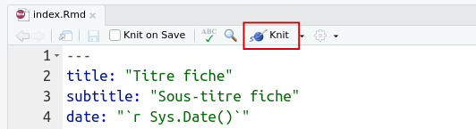

```{r setup, include=FALSE}
library(knitr)
library(kableExtra)
## Global options
knitr::opts_chunk$set(echo=TRUE,
        	            cache=FALSE,
                      prompt=FALSE,
                      comment=NA,
                      message=FALSE,
                      warning=FALSE,
                      class.source="bg-info",
                      class.output="bg-warning")


```


<!-- > Documentation d'aide à la rédaction, la soumission et au processus d'évaluation d'une fiche Rzine -->

# Une fiche Rzine ?  

La "fiche" est le premier format de documentation de la collection Rzine. Il s'agit d'un document didactique qui présente une méthodologie, un type d'analyse, une fonctionnalité, ou encore le traitement d'un certain type de données avec le langage R. Une fiche peut être principalement technique, méthodologique ou thématique, mais elle peut aussi couvrir ces trois aspects. Le premier objectif d'une fiche consiste à partager de manière pédagogique des méthodes reproductibles, applicables en SHS.

La publication de fiche est ouverte à tou·te·s, quels que soient son statut et sa discipline. Une fiche peut être réalisée à plusieurs et présenter une dimension interdisciplinaire. 

Les auteur·e·s sont libres dans le choix de la problématique et dans la façon d'articuler le contenu. Il est cependant indispensable que le contenu d'une fiche soit correctement contextualisé et qu'il soit intelligible par l'ensemble des disciplines de SHS. Il est également obligatoire de suivre les règles suivantes :

- Utiliser le modèle de mise en page [`readrzine`](#utiliser-le-template-readrzine)
- Rédiger en français ou en anglais
- Introduire et contextualiser le contenu 
- Présenter du code entièrement reproductible
- Utiliser des données libres d'utilisation et mises à disposition des lecteurs
- Fournir les fichiers et annexes demandées 


Vous pouvez consulter les premières fiches déjà produites pour vous faire une idée du résultat attendu :    

- [Analyse territoriale multiscalaire](https://rzine.fr/docs/20211101_ysebaert_grasland_MTA/index.html), *Ronan Ysebaert et Claude Grasland*.    
- [Analyse des corrélations avec easystats](https://rzine.fr/docs/20200526_glecampion_initiation_aux_correlations/index.html), *Grégoire Le Campion*.    
- [Exploration spatio-temporelle d’objets géographiques ponctuels](https://rzine.fr/docs/20200601_mletexier86_explo_spatiotemporel/index.html), *Marion Le Texier*. 
- [Réaliser une carte de discontinuités en 2,5D](https://rzine.fr/docs/20191125_ironcurtain/index.html), *Nicolas Lambert*.


Rzine souhaite promouvoir l'usage de logiciels contribuant à une science plus ouverte et reproductible, et participer à une montée en compétence des disciplines de SHS dans ce domaine. C'est pour cela que l'ensemble du processus d'évaluation se déroule sur [GitHub](https://github.com/) (service web d'hébergement et de gestion de développement de logiciels) qui repose sur le logiciel de gestion de versions [Git](https://git-scm.com/). 


<div class="alert alert-success" role="alert">
<b>Cela ne doit en aucun cas effrayer les auteur·e·s qui n'ont jamais utilisé Git. De la documentation et une assistance sont fournies par le comité de lecture Rzine... Profitez-en pour vous former à cet outil !</b></div>

<br/>

## Critères d'acceptation

Afin d'assurer la cohérence de la collection et une certaine qualité du contenu des fiches Rzine, plusieurs critères d'acceptation ont été définis. Certains de ces critères peuvent faire l'objet d'un refus immédiat du [comité de lecture](https://rzine.fr/collection/#people), d'autres sont soumis à plusieurs évaluateur·rice·s.  

Les éditeur·rice·s et les évaluateur·rice·s veilleront à ce que la démonstration soit contextualisée (champ disciplinaire d'application, enjeux en terme de reproductibilité...) et rigoureuse. Le code présenté se doit d'être lisible, commenté et reproductible. Les packages mobilisés doivent être brièvement décrits et leur utilisation justifiée. Enfin, les données utilisées dans le cadre de la démonstration doivent obligatoirement être sourcées, libres de droit et mises à disposition.


|  Critères d'évaluations d'une fiche                                |  Editeur·rice·s | Evaluateur·rice·s |
|--------------------------------------------------------------------|:-------------:|:-------------:|
| Respect des consignes éditoriales ([partie 4](#la-rédaction-dune-fiche))    |       X       |               |
| Acceptation des futures conditions d'utilisation ([partie 1.4](#publication-et-licence-dutilisation)) |      X        |               |
| Pas de fiche Rzine similaire déjà produite*                        |       X       |               |
| N'a pas fait l'objet d'une publication par ailleurs                |       X       |               |
| Pas de renvoi publicitaire explicite                               |       X       |       X       |
| Respect du règlement général sur la protection des données (RGPD)         |       X       |       X       |
| Intérêt pour la communauté des utilisateurs de R en SHS            |       X       |       X       |
| Données utilisées libres, sourcées et mises à disposition  ([partie 4.2](#données-utilisées))        |       X       |       X       |
| Rédaction dans un français ou un anglais correct                   |               |       X       |
| Méthodes applicables en SHS (et sciences territoriales)                          |               |       X       |
| Contextualisation de l'analyse ou méthode présentée ([partie 4.3](#contextualisation))         |               |       X       |
| Présentation des prérequis techniques et méthodologiques           |               |       X       |
| Clarté et rigueur de la ressource et de la démonstration           |               |       X       |
| Clarté (indentation, commentaire...) et reproductibilité du code présenté  |       X        |       X       |
| Justification (et stabilité) des packages utilisés                 |       X      |       X       |

*Le cas échéant, le comité de lecture se réserve la possibilité de mettre en relation différents contributeur.rice.s pour leur proposer un travail collaboratif. 

<br/>

## Format et template

Une fiche Rzine est la sortie HTML d'un fichier R Markdown construit avec R. Les packages nécessaires sont [**`rmarkdown`**](https://rmarkdown.rstudio.com/), [**`knitr`**](https://yihui.org/knitr/) (pour la compilation) et [**`rzine`**](https://gitlab.huma-num.fr/rzine/package) (pour le modèle de mise en page).

Il s'agit d'un document computationnel, alternant du texte et du code, permettant d’appliquer le paradigme de la programmation lettrée. 

<br/>

## Soumission et évaluation

L'ensemble du processus de soumission et d'évaluation d'une fiche se déroule sur [GitHub](https://github.com/). Cela facilite la gestion de version, permet l'archivage et la transparence du processus.

Pour être soumise à évaluation, une fiche doit être déposée et déployée sur GitHub ([cf. partie 5](#la-soumission-dune-fiche)). 

Dans le cas où l'ensemble des critères d'acceptations sont respectés, le comité de lecture désigne un·e éditeur·rice référent·e qui coordonnera tout le processus d'évaluation et de publication. Il propose également deux évaluateur·rice·s à l'auteur·e. Une fois le processus d'évaluation enclenché, les retours des évaluateur·rice·s et de l'éditeur·rice se feront publiquement sur GitHub ([cf. partie 6](#le-processus-de-relecture)).

<br/>
<center>**Le processus d'évaluation et de publication d'une fiche Rzine :**</center>
<br/>
 
```{r, echo=FALSE, out.width="95%",  fig.align = 'center'}
knitr::include_graphics("figures/Rzine_05.png")
```

<br/>

## Publication et licence d'utilisation

<div class="alert alert-success" role="alert">
<b>Une fois le processus d'évaluation terminée, les éditeur·rice·s s'occupent de la mise en page finale de la fiche, de son [<b>stockage pérenne</b>](https://github.com/rzine-reviews), de sa mise en ligne sur le site [<b>rzine.fr</b>](https://rzine.fr/publication_rzine/), du dépôt d'un [<b>DOI</b>](https://www.doi.org/)et de son référencement sur [<b>HAL</b>](https://hal.archives-ouvertes.fr/RZINE).</b></div>

Le projet Rzine souhaite promouvoir les pratiques contribuant à une science plus ouverte et reproductible. C'est pour cette raison que l'ensemble des publications de la collection Rzine, ainsi que leurs codes sources, sont automatiquement mis à disposition de tou·te·s et libres de droit.

<div class="alert alert-danger" role="alert">
<b>Etre auteur.e d'une fiche Rzine, c'est accepter que votre publication (HTML) soit mise à disposition sous les conditions d'utilisation de la [<b>licence Creative Commons BY-SA 4.0</b>](https://creativecommons.org/licenses/by-sa/4.0/deed.fr) et que son code source réponde aux conditions d'utilisation de la licence [<b>MIT</b>](https://opensource.org/licenses/mit-license.php).</b>

<b>Afin d'éviter tout malentendu avec les auteur·e·s, la signature d’un accord de principe sera demandée.</b></div>


# Le package `rzine`

Le package [`rzine`](https://gitlab.huma-num.fr/rzine/package) fournit le modèle de mise en page des fiches Rzine, ainsi que l'architecture de répertoire et l'ensemble des fichiers associés nécessaires.

## Installation du package `rzine`

Le package est mis à disposition sur un [dépôt de l'organisation Rzine](https://gitlab.huma-num.fr/rzine/package) sur l'instance GitLab de la TGIR Huma-num. Pour l'installer et le charger :

```{r, echo=TRUE, eval=FALSE}
# install.packages(remotes)
remotes::install_gitlab("rzine/package", host = "https://gitlab.huma-num.fr/", force = TRUE)
library(rzine)
```

## Utiliser le template `readrzine`

### Spécifier un répertoire de travail

Avant de générer une fiche Rzine vierge il est important de spécifier un répertoire de travail.
Pour cela, deux solutions s'offrent à vous :

**1. En ligne de code**

Créez un répertoire sur votre ordinateur et spécifiez-le comme répertoire de travail avec la fonction `setwd()` :

```{r, echo=TRUE, eval=FALSE}
setwd("/home/jeanne/Documents/Fiche_rzine")
```

**2. En clic-bouton avec Rstudio (recommandé)**

Pour créer un projet Rstudio, cliquez sur *File/New Project*, sélectionnez *New Directory*, puis *New Project* :

```{r, echo=FALSE, fig.align='center', out.width = "55%"}

```
<br>
```{r, echo=FALSE, fig.align='center', out.width = "55%"}

```


<div class="alert alert-success" role="alert">
<b>La création du projet Rstudio engendre la création d'un répertoire au nom du projet et le paramétrage automatique de ce dossier comme répertoire de travail.</b></div>

<br/>

### Générer une fiche vierge (.Rmd)

Une fois dans votre projet Rstudio (ou bien que le répertoire de travail a été spécifié), vous pouvez générer un modèle de mise en page `readrzine` vierge en ligne de commande. Copiez-collez les lignes de code suivantes sans les modifier, puis exécutez :

```{r, echo=TRUE, eval=FALSE}
rmarkdown::draft(file = "index.Rmd", 
                 template = "readrzine", 
                 package = "rzine", 
                 create_dir = FALSE, 
                 edit = FALSE)
```


Cela génère un ensemble de fichiers à la racine de votre répertoire de travail. Certains fichiers sont à modifier ou à ajouter en fonction du contenu de votre fiche : 


```{r, echo=FALSE, fig.align='center', out.width = "90%"}
knitr::include_graphics("figures/files_folder.png")
```

<br/>

## Kniter la fiche (.html)

Pour générer la fiche en format HTML, il suffit de *kniter* (*tricoter*) le fichier ***index.Rmd***. 

Bien que cela soit invisible pour l'utilisateur, le fichier est d'abord converti en format Markdown puis en format HTML via [Pandoc](https://pandoc.org/installing.html) (logiciel libre de conversion de documents). Sur certaines versions de systèmes d'exploitation, le logiciel [Pandoc](https://pandoc.org/installing.html) n'est pas automatiquement disponible. Il est donc parfois nécessaire de l'installer.

Vous pouvez *kniter* le fichier *index.Rmd* de différentes manières :

**1- En ligne de code**


```{r, echo=TRUE, eval=FALSE}
rmarkdown::render("index.Rmd", envir = new.env())

```
**2- En clic-bouton (Rstudio)**


```{r, echo=FALSE, fig.align='center', out.width = "70%"}

```

**3- Avec le raccourci clavier (Rstudio) :**    

- PC : **`CTRL + SHIFT + K`**,   
- Mac : **`Command + Shift + K`**.  


<br/>

**Un fichier du même nom en format HTML est alors créé à la racine de votre répertoire** (***index.html***). Il s'agit du fichier index.Rmd mis en page à partir du modèle `readrzine` :

```{r, echo=FALSE, fig.align='center', out.width = "100%"}

```


Il ne reste plus qu'à le remplir...

<br/>

# Anatomie d'un R Markdown

Bien que dans le cadre d'une publication Rzine certaines métadonnées et informations sont à renseigner et que certaines règles de mise en page doivent être appliquées, le modèle de mise en page **`readrzine`** fonctionne comme n'importe quel autre fichier R Markdown.

<div class="alert alert-success" role="alert">
<b>Ce chapitre est une introduction au langage de balisage Markdown et à la construction de document R Markdown. Il ne vous sera pas utile si vous en maîtrisez déjà les différents aspects.</b></div>


## L'en-tête

L'en-tête d'un document R Markdown (parfois appelé YAML header) est délimité par deux lignes de trois tirets et contient des métadonnées et les éléments de style du document. Voici à quoi ressemble par exemple l'en-tête vierge du template **`readrzine`** :

<!-- ```{r, echo=FALSE, fig.align='center', out.width = "65%"} -->
<!--  -->
<!-- ``` -->

```
---
title: "Titre fiche"
subtitle: "Sous-titre fiche"
date: "`r Sys.Date()`"
author: 
 - name: Premier Auteur.e
   affiliation: Affiliation_1, Affiliation_2
 - name: Second Auteur.e
   affiliation: Affiliation_1, Affiliation_2
image: "featured.png"   
logo: "figures/rzine.png"  
output:
  rzine::readrzine:
    highlight: kate
    number_sections: true
csl: Rzine_citation.csl
bibliography: biblio.bib
nocite: |
  @*
link-citations: true
# github: "author/repository"
# gitlab: "gitlab.huma-num.fr/author/repository"
# doi: "xx.xxx/xxxx.xxxxxxx"
# licence: "by-sa"

# Only Creative Commons Licence 
# 5 possible choices : "by-nd", "by", "by-nc-sa", "by-nc","by-sa"
---
  
  
  

```


## Le texte balisé en markdown

**Le corps d’un document R Markdown comprend deux types de contenu, que l’on peut librement alterner :**

- **Des blocs de texte brut** mis en forme selon la **syntaxe Markdown** ;   
- **Des blocs de code**, appelés ***chunks*** (cf. [partie 3.3](#les-chunks)).  

Le corps du document est constitué de texte mis en forme à l'aide de la syntaxe Markdown. Le Markdown est un langage de balisage léger et très facile à maîtriser, qui permet la mise en forme basique du texte. 

**Par exemple, le texte (brut) suivant :**

```
Ceci est du texte en *italique*, **gras** ou en ***gras italique***.

Pour définir des listes à puces, utilisez les **tirets** :

- premier élément
- second élément

Vous pouvez également ajouter des [liens cliquables](https://rzine.fr/) 

```

**Sera mis en page de la manière suivante dans le fichier HTML généré :**

Ceci est du texte en *italique*, **gras** ou en ***gras italique***.

Pour définir des listes à puces, utilisez les **tirets** :

- premier élément
- second élément

Vous pouvez également ajouter des [liens cliquables](https://rzine.fr/)  

<div class="alert alert-success" role="alert">
<b>Pour tout connaître de la syntaxe markdown, vous pouvez consulter les références bibliographiques listées dans la [partie  3.4](#documentation-de-référence).</b></div>


## Les chunks

En plus du texte libre balisé en markdown, un document R Markdown peut évidemment contenir du code R.    
Celui-ci doit être inclus dans des ***chunks*** délimités par la syntaxe suivante :

````{r, echo=TRUE, eval=FALSE}
```{r}

x <- 37 + 12
print(x)

```
````


<!-- ```{r, echo=FALSE} -->
<!-- rmd = "figures/chunck1.Rmd" -->
<!-- cat(readLines(rmd), sep = "\n") -->
<!-- ``` -->

Pour insérer facilement un nouveau chunk, vous pouvez utiliser le menu ***Insert*** proposé par l’interface de développement RStudio, situé en haut à droite de l'éditeur de texte (à gauche du bouton *Run*) :

```{r, echo=FALSE, fig.align='center', out.width = "15%"}

```

Vous pouvez également utiliser le raccourci clavier `Ctrl + Alt + i` ou `Command + Option + I` pour générer un chunk vide.   


### Nom et options

Vous pouvez nommer chaque *chunk* de la manière suivante :

````{r, echo=TRUE, eval=FALSE}
```{r nom_du_chunck}

```
````

Un nom de *chunk* doit être unique. Il n'est pas obligatoire de nommer un *chunk*, mais cela peut être utile pour localiser une erreur lors de la compilation du code.

<!-- ```{r, echo=FALSE} -->
<!-- rmd = "figures/chunck2.Rmd" -->
<!-- cat(readLines(rmd), sep = "\n") -->
<!-- ``` -->

Des options peuvent être ajoutées sous la forme `option = valeur`. Elles permettent de paramétrer le comportement d'un *chunk* lors d'un *knit* (compilation du document). Exemple : 

````{r, echo=TRUE, eval=FALSE}
```{r nom_du_chunck, echo = FALSE, warning = FALSE}

x <- 37 + 12
print(x)

```
````

L'option `echo` permet d'afficher (ou pas) le code dans le document généré, et  l'option `warning` permet d'afficher (ou non) les avertissements générés par le code en sortie. Voici la liste des principales options disponibles :

Option   |    Valeurs    |  Description
---------|---------------|-------------------------------------------
echo     | TRUE/FALSE    | Afficher ou non le code R dans le document en sortie
eval     | TRUE/FALSE    | Exécuter ou non le code R durant la compilation du R Markdown
include  | TRUE/FALSE    | Inclure ou non le code R et ses résultats dans le document
warning  | TRUE/FALSE    | Afficher ou non les avertissements générés par le code du chunk
message  | TRUE/FALSE    | Afficher ou non les messages générés par le code du chunk

**L'ensemble des options disponibles sont décrites dans le** [**guide de référence R Markdown**](https://www.rstudio.com/wp-content/uploads/2015/03/rmarkdown-reference.pdf), et également dans plusieurs références listées ci-dessous.


## Documentation de référence

**Pour en savoir plus, pour se former au R Markdown et à la syntaxe markdown :**

- [Cookbook R Markdown](https://bookdown.org/yihui/rmarkdown-cookbook/), de Y. Xie, C. Dervieux & E. Riederer
- [R Markdown Definitive Guide](https://bookdown.org/yihui/rmarkdown/), de Y. Xie, J. J. Allaire & G. Grolemund
- [R Markdown for Scientists](https://rmd4sci.njtierney.com/), de Nicholas Tierney
- [Introduction à R et au tidyverse](https://juba.github.io/tidyverse/13-rmarkdown.html), de Julien Barnier 
- [Travail collaboratif avec R](https://linogaliana.gitlab.io/collaboratif/rmd.html), de Lino Galiana
- [Pimp my RMD: a few tips for R Markdown](https://holtzy.github.io/Pimp-my-rmd/), de Yan Holtz
- [R for Data Science](https://r4ds.had.co.nz/r-markdown.html), de H. Wickham & G. Groelemund
- [Guide de la syntaxe R Markdown](https://rmarkdown.rstudio.com/authoring_basics.html), de Rstudio
- [Guide de référence R Markdown](https://www.rstudio.com/wp-content/uploads/2015/03/rmarkdown-reference.pdf), de Rstudio 
- [R Markdown Cheatsheet](https://www.rstudio.com/wp-content/uploads/2015/02/rmarkdown-cheatsheet.pdf), de Rstudio
- [Writing Reproducible Research Papers with R Markdown](https://resulumit.com/teaching/rmd_workshop.html#1), de Resul Umit


 
 
# La rédaction d'une fiche

Les auteur.e.s sont libres dans le choix de la problématique et dans la façon d’articuler le contenu de leur fiche Rzine mais, **afin d'assurer une certaine cohérence éditoriale et une qualité du contenu de la collection, les auteur.e.s sont soumis à quelques obligations**.


## Métadonnées d'en tête

Commencez par modifier l'en-tête du template **`readrzine`** (YAML header), en personnalisant le **titre**, le **sous-titre**, le nom de ou des **auteur.es** et les **affiliations**, comme par exemple : 


```
---
title: "Analyse textuelle exploratoire"
subtitle: "Exploration d'un corpus de lettre avec le package Quanteda"
date: "`r Sys.Date()`"
author: 
 - name: Jeanne Dupont
   affiliation: UMR TEXTO, CNRS
 - name: Paul Edouard
   affiliation: Centre documentaire ED, Université de France

```


<!-- ```{r, echo=FALSE, fig.align='center', out.width = "75%"} -->
<!-- knitr::include_graphics("figures/metadata.png") -->
<!-- ``` -->
<br/>

## Le résumé

Il est obligatoire de proposer un résumé en début de publication. Ce résumé sera utilisé pour la page de présentation de la fiche (cf. [exemple](https://rzine.fr/publication_rzine/20211101_ysebaert_grasland_mta/)) sur le site rzine.fr, pour le dépôt Github du code source (cf. [exemple](https://github.com/rzine-reviews/mta_rzine)), du DOI et le référencement sur HAL.

**Ce résumé doit faire entre 250 à 800 caractères (espaces comprises).**
Il peut comprendre des informations sur d'éventuels prérequis pour bien comprendre le document.

Pour mettre en forme votre résumé en introduction de fiche, utilisez le symbol "**>**" qui permet de créer un bloc de citation qui apparaîtra sur un fond gris. Exemple :

```
> Ce document... xx x xx x xx xxx xxxx xx xx xxxx x xx x xxx xxxx x xx xxx xxxx xx xx xxxx x xx x xxx

> **Prérequis** : xx x xx x xx xxx xxxx xx xx xxxx x xx x xxx xxxx x xx xxx xxxx xx xx xxxx x xx x xxx
````

Le bloc de citation apparaîtra comme suit :

> Ce document... xx x xx x xx xxx xxxx xx xx xxxx x xx x xxx xxxx x xx xxx xxxx xx xx xxxx x xx x xxx

> **Prérequis** : xx x xx x xx xxx xxxx xx xx xxxx x xx x xxx xxxx x xx xxx xxxx xx xx xxxx x xx x xxx

<br/>

## Contextualisation

Il est essentiel et obligatoire d'introduire et de contextualiser le contenu de votre document. 

<div class="alert alert-success" role="alert">
<b>Une fiche Rzine doit s'adresser à l'ensemble des disciplines de SHS et des sciences territoriales. Considérez que vos lecteur.rice.s ne seront pas forcément des spécialistes de la thématique ou méthode présentée.</b></div>

Vous pouvez pour cela vous appuyer sur des références bibliographiques, utiles pour les non-spécialistes de la thématique ou de la méthode présentée (cf. [partie 4.10](#références-bibliographiques)).

<br/>

## Données utilisées


### Conditions d'utilisation

Pour assurer le reproductibilité complète de la fiche, les données utilisées doivent obligatoirement être mises à disposition des lecteur·rice·s. Pour ne pas empêcher la diffusion publique et libre de la fiche, **vous ne pouvez pas utiliser de données soumises à des restrictions de diffusion et d'utilisation publiques**.


<div class="alert alert-danger" role="alert">
<b>Les données mobilisées doivent pourvoir être librement diffusées et utilisées par tous les lecteur·rice·s. Il est très important de vérifier leurs conditions d'utilisations.</b></div>


### Présentation

Les données doivent être directement présentées, sourcées et brièvement décrites dans la fiche (cf.[exemple](https://rzine.fr/docs/20211101_ysebaert_grasland_MTA/index.html#sources-mobilis%C3%A9es)).
Consacrez-y un chapitre ou sous-chapitre en fonction de leurs spécificités.


### Mise à disposition

Même si les données mobilisées sont déjà librement mises à disposition, **il est obligatoire de les sauvegarder dans votre répertoire et de les rendre directement téléchargeables depuis la fiche**.


```{r, echo=FALSE, fig.align='center', out.width = "15%"}

```


Pour cela :

1) Copiez votre (ou vos) fichier(s) de données dans le sous-répertoire "***data***".    


2) Remplissez le fichier ***metadata.md*** (Markdown) situé à la racine, avec toutes les métadonnées nécessaires et obligatoires. Ce fichier doit contenir toutes les informations utiles pour comprendre et retrouver ces données à la source.


3) Ajoutez un bouton de téléchargement des données dans votre fiche, en copiant-collant ce bout de code HTML :


````
<br/>

<p class="center">[<span style="font-size: 230%;" class="glyphicon glyphicon-download-alt"></span><br/>Télécharger les données](https://rzine.fr/docs/...../data.zip)</p>

<br/>

````

Voici le rendu :

<br/>

<p class="center">[<span style="font-size: 230%;" class="glyphicon glyphicon-download-alt"></span><br/>Télécharger les données](https://rzine.fr/docs/20211101_ysebaert_grasland_MTA/data.zip)</p>

<br/>


<div class="alert alert-danger" role="alert">
<b>C'est ensuite aux éditeur·rice·s de rendre ce lien opérationnel durant le processus de publication.</b></div>

<br/>

## Packages et fonctions

Comme pour les données, il est important de consacrer un sous-chapitre aux packages utilisés. 
**Tous les packages mobilisés pour l'analyse doivent être listés et décrits** (cf. [exemple](https://rzine.fr/docs/20211101_ysebaert_grasland_MTA/index.html#packages-n%C3%A9cessaires)) :     
- `package1` : description...   
- `package2` : description...   
- `package3` : description...   


Tous les packages et fonctions explicitement nommés doivent également être mis en page de cette façon :

````
`packages` et `fonction()`
````

Voici le rendu : `packages` et `fonction()`

<div class="alert alert-danger" role="alert">
<b>L'utilisation d'un package doit être justifiable. Les éditeur·rice·s seront particulièrement attentif.ve.s à l'utilisation de packages le plus récents ou mis à disposition via un logiciel de gestion de versions.</b></div>

<br/>

## Illustration

### Illustration de couverture

Le template `readrzine` permet l'affichage d'une illustration en couverture.

```{r, echo=FALSE, fig.align='center', out.width = "100%"}

```


<div class="alert alert-success" role="alert">
<b>Cela n'est pas obligatoire. Supprimez la métadonnée concernée (*image:*) dans l'en-tête du R Markdown si vous ne souhaitez pas d'image de couverture</b></div>

```{r, echo=FALSE, fig.align='center', out.width = "30%"}
knitr::include_graphics("figures/meta_featured.png")
```

<div class="alert alert-success" role="alert">
<b>Pour modifier l'illustration par défaut, remplacez l'image nommée featured.png à la racine du répertoire par celle de votre choix (le nom doit être identique !).</b></div>


```{r, echo=FALSE, fig.align='center', out.width = "25%"}
knitr::include_graphics("figures/featured.png")
```

Le format optimal de cette image de couverture est de type "bandeau" (ex : 750 x 300 pixels).


### Image dans le corps du texte

**Les images affichées dans le corps du texte doivent être stockées dans le répertoire "figures"**. Il existe plusieurs solutions pour insérer des images dans un document R Markdown. Il est possible d'utiliser du code R dans un *chunk*, d'utiliser le langage Markdown ou HTML (recommandé). 

Pour insérer une image en HTML : 

```
<figure class="center">
  
  
  <figcaption style="font-size:13px;">Logo de la collection Rzine, 2021,  [https://rzine.fr/collection/#collection](https://rzine.fr/collection/#collection){target="_blank"}</figcaption>

</figure>
```

Cela affichera l'image centrée et large de 200 pixels, ainsi qu'un titre (source) :

<figure class="center">
  
  
  <figcaption style="font-size:13px;">Logo de la collection Rzine, 2021,  [https://rzine.fr/collection/#collection](https://rzine.fr/collection/#collection){target="_blank"}</figcaption>

</figure>

<br/>

<div class="alert alert-danger" role="alert">
<b>Les illustrations utilisées doivent impérativement être libres d'utilisation et sourcées. Dans le cas contraire, elles seront supprimées par les éditeur·rice·s.</b></div>

<br/>


## Ecriture de code R

Le code R présenté dans la fiche doit être indenté, espacé et commenté. 
**Il est demandé aux auteur·e·s de prendre soin de la syntaxe et de respecter les principales conventions d'écriture.**

Pour en savoir plus, vous pouvez consulter [The tidyverse style guide](https://style.tidyverse.org/syntax.html) d'Hadley Wickham. 

<br/>

## Message d'alerte

Il est possible d'utiliser certains [messages d'alerte boostrap](https://getbootstrap.com/docs/4.0/components/alerts/) :   

- Encadré vert (*success*) : pour mettre en avant une information   
- Encadré rouge (*danger*) : our mettre en relief une information primordiale   

La syntaxe HTML à utiliser est : 


````
<div class="alert alert-success" role="alert">Message d'information</div>

**ET**
 
<div class="alert alert-danger" role="alert">Message <b>très important</b></div>
````

Voici le rendu :

<div class="alert alert-success" role="alert">Message d'information</div>

**ET**
 
<div class="alert alert-danger" role="alert">Message <b>très important</b></div>

<br/>

## Formules mathématiques

Il est possible d'[écrire des formules mathématiques en langage $\TeX$](https://rmd4sci.njtierney.com/math.html). Il suffit de délimiter le contenu $\LaTeX$ par **un ou deux** symboles **$**, ex :  

```
$$ y = \sqrt{\frac{1}{x + \beta}} $$ 
```
En mode ***Inline*** (**un seul $**) , les formules sont incluses à l'intérieur du paragraphe courant, ex : $\sum_{i=1}^n X_i$    
En mode ***Displayed*** (**deux $**), elles apparaissent centrées et mises en exergue, ex : $$ y = \sqrt{\frac{1}{x + \beta}} $$   

<br/>

## Références bibliographiques


Le template `readrzine` intègre automatiquement une section de références bibliographiques. Il est fortement recommandé aux auteur·e·s de l'utiliser. Cependant cette section n'est pas obligatoire, vous pouvez supprimer les lignes suivantes dans le fichier *index.rmd* si vous ne souhaitez pas afficher de bibliographie :

```
# Bibliographie {-}

<div id="refs"></div>
```

**Sinon, pour ajouter des références bibliographiques, complétez le fichier *biblio.bib*.**


```{r, echo=FALSE, fig.align='center', out.width = "25%"}
knitr::include_graphics("figures/biblio_folder.png")
```

Trois références bibliographiques sont saisies par défaut dans le fichier *biblio.bib* :

```
@Manual{R-base,
  title = {R: A Language and Environment for Statistical Computing},
  author = {{R Core Team}},
  organization = {R Foundation for Statistical Computing},
  address = {Vienna, Austria},
  year = {2020},
  url = {https://www.R-project.org/},
}

@Manual{R-knitr,
  title = {knitr: A General-Purpose Package for Dynamic Report Generation in R},
  author = {Yihui Xie},
  year = {2020},
  note = {R package version 1.28},
  url = {https://CRAN.R-project.org/package=knitr},
}

@Manual{R-rmdformats,
  title = {rmdformats: HTML Output Formats and Templates for 'rmarkdown' Documents},
  author = {Julien Barnier},
  year = {2021},
  note = {R package version 1.0.2},
  url = {https://github.com/juba/rmdformats},
}
```

Beaucoup de documentation sur les fichiers BibTex sont consultables sur internet ([exemple](https://doc.archives-ouvertes.fr/x2hal/bibtex-exemple/)). Supprimez et ajoutez les références bibliographiques que vous souhaitez.


<div class="alert alert-success" role="alert">
<b>Pour citer une référence dans le corps du texte, utilisez la syntaxe suivante : `[@Citation Key]`.   
Citation Key = nom de la référence dans le fichier BibTex (ex : R_base, R-knitr ou R-rmdformats).    
Par exemple, la chaîne de caractère `[@R-base]` affichera le lien [@R-base] dans le document.

Toutes les références bibliographiques renseignées dans le fichier biblio.bib seront automatiquement ajoutées dans la section « [Bibliographie](#bibliographie) ».</b></div>


<br/>


## Glossaire


Cette section n'est pas obligatoire, cependant vos lecteur.rices ne seront pas forcément issu·es de votre discipline ou ne maîtriseront peut-être pas la thématique ou méthode présentée. En définissant certains termes utilisés, la section « [Glossaire](#endnotes) » permet de rendre la démonstration compréhensible à un public plus large.


**Pour ajouter un mot ou expression, ainsi que sa définition dans le [Glossaire](#endnotes), utilisez la syntaxe markdown suivante**  :

```
texte texte texte mot à définir^[__Mot à définir__: Définition du terme... ]
```

A la compilation du document en format HTML, un numéro est automatiquement associé et affiché après le "mot à définir". Ce mot/expression et sa définition sont ajoutés dans la section « [Glossaire](#endnotes) ». Exemple : **Mot à définir**^[__Mot à définir__: Définition du terme à définir... ect.]


<div class="alert alert-success" role="alert">
<b>Comme pour les références bibliographiques, un lien est automatiquement créé entre le "mot" dans le corps du texte et sa définition dans le glossaire.</b></div>


**Si vous ne souhaitez pas utiliser de [Glossaire](#endnotes), supprimez les lignes suivantes dans le fichier *index.rmd* :**

````{verbatim}
## Glossaire {- #endnotes}

```{js, echo=FALSE}

$(document).ready(function() {
  $('.footnotes ol').appendTo('#endnotes');
  $('.footnotes').remove();
});

```


<br/>
````

<br/>


## Informations sur la session

Cette **section obligatoire** est directement intégrée au template.

````{verbatim}
## Info session  {-}

```{r session_info, echo=FALSE}
kableExtra::kable_styling(knitr::kable(rzine::sessionRzine()[[1]], row.names = F))
kableExtra::kable_styling(knitr::kable(rzine::sessionRzine()[[2]], row.names = F))
```
````

<div class="alert alert-danger" role="alert">
<b>Ne pas modifier ni déplacer cette section !</b></div>
 

Ce bout de code affiche des informations sur la session qui a permis de générer la fiche (système d'exploitation, versions de R et des packages utilisés). Voir l'[exemple](#info-session) pour ce document.

<br/>

## Citation BibTex 

Cette **section obligatoire** est directement intégrée au template.

````{verbatim}
## Citation {-}

```{r Citation, echo=FALSE}

rref <- bibentry(
   bibtype = "article",
   title = "Titre de la fiche",
   author = person("Auteur.e 1", "Auteur.e 2" ),
   journal = "Rzine.fr",
   publisher = "FR CIST",
   year = 2021,
   url = "https://...")

``` 

`r capture.output(print(rref))`

### BibTex : {-}

```{r generateBibTex, echo=FALSE}

writeLines(toBibtex(rref), "cite.bib")
toBibtex(rref)

``` 


<br/>
````


**Ne mofifiez pas cette section, elle sera complétée avant publication par l'équipe éditoriale.**
Ces deux *chunks* permettent l'affichage de la référence bibliographique de votre fiche dans le corps du document ([Voir l'exemple pour ce document](#citation)), ainsi que le stockage de cette référence en format BibTex, enregistrée dans le fichier *cite.bib* à la racine du répertoire.


# La soumission d'une fiche

Une fois que le fichier index.Rmd est rédigé et qu'il a été compilé en format HTML ([knit](#kniter-la-fiche--html)), vérifiez que les annexes ([biblio.bib](#références-bibliographiques), [featured.png](#illustration-de-couverture), [figures](#image-dans-le-corps-du-texte) et [data](#données-utilisées)) ont été complétées, remplacées ou supprimées.    

<div class="alert alert-danger" role="alert">
**Il est impératif que les fichiers** "***.Rmd***" et "***.html***" **soient nommés** "***index.Rmd***" et  "***index.html***" **pour la suite du processus.**</div>

Vous êtes alors en mesure de soumettre votre travail au comité de lecture Rzine. Pour cela, vous devez :   

**1) Déposer votre travail sur un dépôt Git** ([logiciel de gestion de versions décentralisé](https://fr.wikipedia.org/wiki/Git)).     
**2) Déployer la fiche en format HTML depuis le dépôt GitHub** pour la rendre consultable en ligne.    
**3) Contacter le comité de lecture** en lui fournissant l'adresse du dépôt.    


<div class="alert alert-success" role="alert">
<b>Ne soyez pas inquiet si vous n'avez aucune connaissance de Git, la section suivante détaille clairement toutes les étapes à réaliser.</b></div>

<br/>

## Premiers pas sur Github

Le logiciel de gestion de versions décentralisé que vous devez utiliser pour la soumission est [**GitHub**](https://github.com/). 

### Création de compte

Commencez par vous connecter à la [page de création de compte GitHub](https://github.com/signup?ref_cta=Sign+up&ref_loc=header+logged+out&ref_page=%2F&source=header-home). 

```{r, echo=FALSE, fig.align='center', out.width = "60%"}
knitr::include_graphics("figures/email_github.png")
```

Saisissez le courriel que vous souhaitez utiliser, un mot de passe, un nom d'utilisateur et répondez aux questions de sécurité pour créer votre compte. Un code de sécurité vous sera envoyé au courriel renseigné afin de valider la création du compte.

### Création d'un dépôt

Vous avez désormais un compte GitHub. **Cliquez sur** "***Start a project***" ou "***Create repository***" **pour créer un dépôt qui hébergera votre fiche**.

```{r, echo=FALSE, fig.align='center', out.width = "100%"}
knitr::include_graphics("figures/welcome_github.png")
```


Vous pouvez également créer un nouveau dépôt en cliquant sur "***+***" puis "***New repository***" en haut à droite de la fenêtre :

```{r, echo=FALSE, fig.align='center', out.width = "40%"}
knitr::include_graphics("figures/new_repo.png")
```

Un fois sur la page de création d'un nouveau dépôt, **saisissez un nom de dépôt** (sans espaces ni caractères spéciaux) et éventuellement une description. **Initialisez ce dépôt comme** ***Public*** et **demandez l'ajout automatique d'un fichier** ***README.md*** :

```{r, echo=FALSE, fig.align='center', out.width = "70%"}

```

Puis cliquez sur "***Create repository***". **Votre dépôt**, uniquement rempli d'un fichier README.md, **a été créé :**

```{r, echo=FALSE, fig.align='center', out.width = "100%"}

```

<br/>

## Remplissage du dépôt

Vous pouvez désormais y ajouter le répertoire (et sous-répertoires) contenant tous les fichiers de votre fiche. Il existe plusieurs méthodes pour téléverser des fichiers sur GitHub (en ligne de commande ou en clic-bouton). Nous présentons ici la méthode clic-bouton depuis l’interface de GitHub.

Cliquez sur "***Add file***", puis sur "***Upload files***" :.

```{r, echo=FALSE, fig.align='center', out.width = "45%"}

```


<br/>

<div class="alert alert-danger" role="alert">
**Faîtes glisser l'ensemble des fichiers et sous-répertoires de votre fiche**, c'est-à-dire tous les fichiers et répertoires présents dans votre projet Rstudio, **dans ce dépôt**.</div>


```{r, echo=FALSE, fig.align='center', out.width = "100%"}
knitr::include_graphics("figures/drag_files.png")
```

**Ajoutez un commentaire et cliquez sur** "***Commit changes***" :

```{r, echo=FALSE, fig.align='center', out.width = "100%"}
knitr::include_graphics("figures/commit_changes.png")
```

**Vous venez de réaliser votre premier** "***commit***" (enregistrement des changements). **L'ensemble des fichiers est désormais stocké sur le dépôt :** 

```{r, echo=FALSE, fig.align='center', out.width = "100%"}
knitr::include_graphics("figures/commit.png")
```

Ce dépôt étant paramétré comme *public*, **tout le monde peut désormais le consulter et récupérer les fichiers qu'il contient**.

<br/>

## Déploiement de la fiche

Les fichiers sont consultables à l'état brut, mais **une manipulation supplémentaire va permettre de mettre en ligne votre fiche (format HTML)**. **Votre fiche mise en forme sera ainsi consultable par tout le monde sur le web**, sans avoir à gérer un serveur ou un site web.

### GitHub Page

Dans le dépôt concerné, **cliquez sur** "***Settings > Pages > Source (none)***" et sélectionnez la branche "***main***" :

```{r, echo=FALSE, fig.align='center', out.width = "100%"}
knitr::include_graphics("figures/deploy.png")
```

<div class="alert alert-danger" role="alert">
**Pour que cela fonctionne, le fichier html à déployer (et le rmd pour plus de cohérence) doivent impérativement avoir été renommés** "***index***".</div>

<br/>

**Ne modifiez pas le répertoire ciblé par défaut** **(**"***root***"**)** et **cliquez sur** "***save***" **:**

```{r, echo=FALSE, fig.align='center', out.width = "80%"}
knitr::include_graphics("figures/GitHub_Pages.png")
```

<div class="alert alert-success" role="alert">
<b>Votre fiche est désormais consultable en ligne depuis votre compte GitHub !</b>   

La page html est alors distribuée à l'adresse suivante : https://<b>username</b>.gitub.io/<b>repository_name</b>.</b></div>

<br/> 

Vous pouvez retrouver l'URL d'accès dans le menu "*Settings > Pages*" :

```{r, echo=FALSE, fig.align='center', out.width = "90%"}

```
  
**Cliquez sur le lien affiché pour consulter la fiche mise en ligne :**

```{r, echo=FALSE, fig.align='center', out.width = "100%"}

```


### README.md

Le fichier markdown *README.md* est utilisé pour présenter les informations importantes à propos du dépôt. Son contenu est automatiquement affiché (et mis en forme grâce à la syntaxe markdown) sous les fichiers listés du dépôt.

Vous pouvez éditer et modifier facilement ce fichier depuis l'interface GitHub en cliquant sur le symbole crayon :

```{r, echo=FALSE, fig.align='center', out.width = "90%"}
knitr::include_graphics("figures/readme.png")
```

**Vous pouvez alors personnaliser le fichier** en modifiant : le **titre**, le **sous-titre**, le.s **auteur.e.s** (et **affiliation.s**), et l'**URL de consultation de la fiche**. Exemple :

```{r, echo=FALSE, fig.align='center', out.width = "100%"}
knitr::include_graphics("figures/readme2.png")
```

Une fois les modifications terminées, **commentez votre** ***commit***, puis **cliquez sur** ***Commit changes*** pour enregistrer les modifications :

```{r, echo=FALSE, fig.align='center', out.width = "80%"}

```

</br>

<div class="alert alert-success" role="alert">
<b>Vous avez terminé la mise en ligne de votre fiche. Désormais, un lien vers votre fiche déployée est affiché à la racine du dépôt grâce au fichier README.md.</b></div>


```{r, echo=FALSE, fig.align='center', out.width = "100%"}

```

## Soumettre

Il ne vous reste plus qu'à contacter le comité de lecture Rzine pour soumettre votre fiche pour évaluation.  **Envoyez un courriel à [collection[a]rzine.fr](mailto:collection@rzine.fr), en précisant l'adresse du dépôt qui héberge votre fiche.**

**Vous serez contacté·e par le comité de lecture dans les 15 jours suivants l'envoi de ce courriel.**


# Le processus de relecture

En cas d'acceptation, **un ou une éditeur·rice désigné·e par la direction du comité de lecture prendra sous sa responsabilité le du processus de relecture**.

**Deux relecteur·rice·s doté·e·s des connaissances thématiques nécessaires seront proposé·e·s à l'auteur·e**. Rzine est dans une démarche volontariste de science ouverte, la relecture des fiches Rzine est ouverte et transparente. L’identité des relecteur·rice·s et leurs retours sont publics.

Parce qu'une fiche est un document computationnel, l'ensemble du processus se déroule sur GitHub. Vous serez donc invité·e à ouvrir les droits du dépôt GitHub de votre fiche aux relecteur·rice·s désigné·e·s. **Les retours (enrichissements, illustrations, corrections...) se feront se feront  directement sur la plateforme GitHub via des** ***issues***.

</br>


<div class="alert alert-danger" role="alert">
<b>Rédaction d'une documentation sur le processus de relecture à venir.</b></div>


<!-- # Le processus éditorial -->

<!-- ## Mise en page finale -->

<!-- ## Attribution d'un DOI -->

<!-- En cas de publication, un **DOI** ([Digital Object Identifier](https://fr.wikipedia.org/wiki/Digital_Object_Identifier)) sera attribué à chaque fiche par le biais de [l'Institut de l'information scientifique et technique](https://www.inist.fr/?lang=en) du CNRS (INIST). -->

<!-- **Le DOI (et le lien vers la page des métadonnées) sera ajouté sur le document par le comité éditorial :** -->

<!-- ```{r, echo=FALSE, fig.align='center', out.width = "40%"} -->
<!--  -->
<!-- ``` -->

<!-- ## Dépôt sur HAL -->

<!-- ## Mise en ligne de la fiche -->

<!-- Un fois le processus de publication terminé, la fiche sera accessible à tout le monde depuis son dépôt Git. Pour une meilleure visibilité, **elle sera également référencée et mise en valeur sur le site** [**rzine.fr**](https://rzine.fr/) :  -->

<!-- ```{r, echo=FALSE, fig.align='center', out.width = "100%"} -->
<!-- knitr::include_graphics("figures/rzine_fr.png") -->
<!-- ``` -->


# Question ?

Pour toute question relative au processus de soumission et de relecture d'une fiche, **vous pouvez contacter le comité de lecture à l'adresse [collection[a]rzine.fr](mailto:collection@rzine.fr).**


# Bibliographie {-}

<div id="refs"></div>

# Annexes {-}

## Info session  {-}

```{r session_info, echo=FALSE}
kableExtra::kable_styling(knitr::kable(rzine::sessionRzine()[[1]], row.names = F))
kableExtra::kable_styling(knitr::kable(rzine::sessionRzine()[[2]], row.names = F))
```

## Citation {-}

```{r Citation, echo=FALSE}
rref <- bibentry(
   bibtype = "misc",
   title = "Publier une fiche Rzine",
   subtitle = "Processus de rédaction, soumission et relecture d’une fiche Rzine",
   author = c("Rzine"),
   doi = "10.48645/xxxxxx",
   url = "https://rzine.fr/publication_rzine/xxxxxxx/",
   keywords ="FOS: Other social sciences",
   language = "fr",
   publisher = "FR2007 CIST",
   year = 2021,
   copyright = "Creative Commons Attribution Share Alike 4.0 International")
   
   

``` 

`r capture.output(print(rref))`

### BibTex : {-}

```{r generateBibTex, echo=FALSE}

writeLines(toBibtex(rref), "cite.bib")
toBibtex(rref)

``` 

<br/>

## Glossaire {- #endnotes}

```{js, echo=FALSE}

$(document).ready(function() {
  $('.footnotes ol').appendTo('#endnotes');
  $('.footnotes').remove();
});

```
